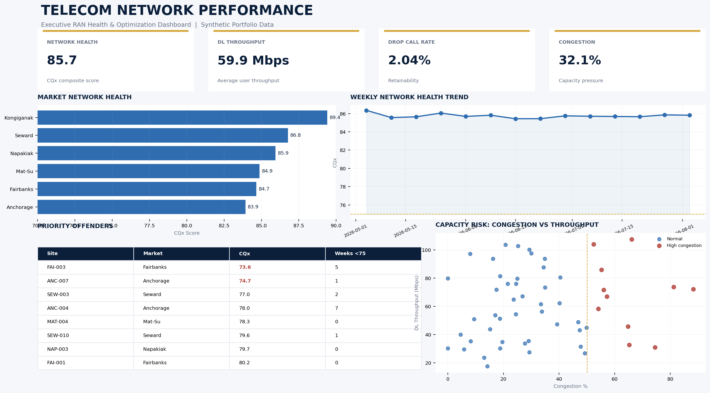

# 📡 Telecom Network Performance Dashboard

**Power BI • SQL • Python • Telecom Analytics • KPI Monitoring**

A telecom analytics portfolio project designed to identify network performance degradation, chronic offenders, capacity risks, and optimization priorities across markets and sites.

## 🎯 Business Problem

Telecom engineering and operations teams manage thousands of network KPIs across markets, sites, and cells.

The challenge is turning this data into actionable information:

- Which markets are degrading?
- Which sites are driving poor performance?
- Are problems temporary or chronic?
- Where is congestion affecting throughput?
- Which sites should engineering teams investigate first?

This dashboard converts raw network KPI data into an executive and engineering performance view.

## 📊 Dashboard Highlights

### Network Health
Tracks overall network performance using a composite **CQx Network Health Score**.

### Market Performance
Compares network health across markets to quickly identify areas requiring attention.

### Worst Performing Sites
Ranks sites based on KPI degradation and overall network health.

### Chronic Offender Analysis
Identifies sites remaining below performance thresholds for multiple reporting periods.

### Capacity Risk
Analyzes the relationship between **congestion and downlink throughput** to identify potential capacity constraints.

### Weekly KPI Trends
Tracks network performance over time to identify improving or degrading trends.

## 📡 KPIs Analyzed

| KPI | Purpose |
|---|---|
| RRC Success Rate | Network accessibility |
| ERAB Success Rate | Bearer establishment performance |
| Drop Call Rate | Network retainability |
| DL Throughput | User data performance |
| Congestion | Capacity utilization |
| CQx Score | Composite network health |

## 🧮 Network Health Score

The project uses a weighted composite KPI:

**CQx =**

`0.25 × RRC SR`  
`+ 0.25 × ERAB SR`  
`+ 0.15 × (100 − DCR)`  
`+ 0.20 × Throughput`  
`+ 0.15 × (100 − Congestion)`

Performance classification:

🟢 **Green:** CQx > 75  
🟡 **Yellow:** CQx 70–75  
🔴 **Red:** CQx < 70

## 🔍 Example Business Insights

The analysis allows network teams to:

- Identify markets contributing most to network degradation
- Rank worst-performing sites
- Detect recurring/chronic network issues
- Separate capacity problems from general KPI degradation
- Prioritize optimization activities
- Monitor whether corrective actions improve performance

## 🛠️ Technical Skills Demonstrated

**Business Intelligence**
- Power BI
- Dashboard design
- KPI development
- Executive reporting

**Data Analytics**
- SQL
- Python
- Data aggregation
- Trend analysis
- Ranking and exception reporting

**Telecom Analytics**
- RAN performance analysis
- Accessibility
- Retainability
- Throughput
- Congestion
- Capacity analysis
- Chronic offender identification

## 📂 Repository Contents

| File | Description |
|---|---|
| `dashboard-preview.png` | Executive dashboard preview |
| `telecom_network_kpi_sample.csv` | Synthetic weekly network KPI dataset |
| `site_priority_summary.csv` | Site ranking and chronic-offender summary |
| `analysis.sql` | SQL KPI analysis and ranking examples |
| `KPI_DEFINITIONS.md` | KPI definitions and business logic |

## 🔐 Data Privacy

All data in this project is **synthetic and created exclusively for portfolio demonstration**.

No proprietary network, customer, site, carrier, or employee information is included.
